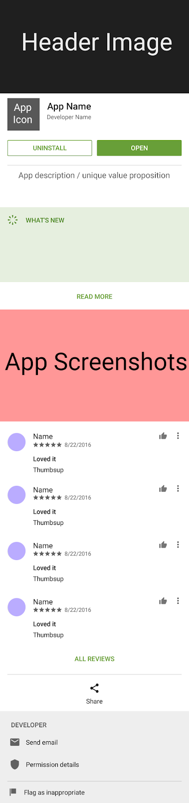

# 
Android Illustrations II 

 <a href="https://developer.android.com" target="_blank" rel="noreferrer"> &nbsp;&nbsp;&nbsp;&nbsp;&nbsp;&nbsp&nbsp;<a href="https://firebase.google.com/" target="_blank" rel="noreferrer"> &nbsp;&nbsp;&nbsp;&nbsp;&nbsp;&nbsp&nbsp; </a> <a href="https://git-scm.com/" target="_blank" rel="noreferrer">  &nbsp;&nbsp;&nbsp;&nbsp;&nbsp;&nbsp&nbsp;</a>  

## Table of contents
* [Advanced Layout Design](#advanced-layout-design)
* [Media Playback](#media-playback)
* [Quick Links](#quick-links)
* [Copyright](#copyright)
* [Contact](#contact)

 

<h2 align="center">** Please allow a few minutes for GIFs to load **   Thank you so much</h2>

 

### Advanced Layout Design

__Main concept__: Build a Google Play Store mockup.

__Topics of research:__

* Material Design
* Nested Layouts
* Parallax collapsing toolbar layout

  
&nbsp;&nbsp;&nbsp;&nbsp;&nbsp;&nbsp&nbsp;&nbsp;&nbsp;&nbsp;&nbsp&nbsp&nbsp;&nbsp;

 
 

### Media Playback

__Main concept__: Build a media player app that plays songs in sequence. The application should be able to run while closed by using a foreground service. Some of the playback functionality will also be accessible through a notification. Notification allows the user to skip to previous or next song.

Topics of research:

* Media Player Class
* Finite State Machine
* Foreground Services 
* Expanded Style Notifications
* Audio Playback
* Seekbars & Runnables
* Raw Resources
* Retrieve meta-data from media file

 

  
&nbsp;&nbsp;&nbsp;&nbsp;&nbsp;&nbsp&nbsp;&nbsp;&nbsp;&nbsp;&nbsp&nbsp&nbsp;&nbsp;

 

  

 

  

 

## Quick Links

### [Click Here to View iOS Illustrations](https://github.com/EShenoda/iOS-Game)

### [Click Here to View iOS Illustrations using SwiftUI](https://github.com/EShenoda/SwiftUI)

### [Return to Home Page](https://github.com/EShenoda)

##  Copyright
Private Repo for EmilShenodaDev@gmail.com

All rights reserved: EmilShenoda@FullSailUniversity

## Contact
Created by [Emil Shenoda](mailto:EmilShenodaDev@gmail.com) - feel free to contact me!

[Back to top](#table-of-contents)
